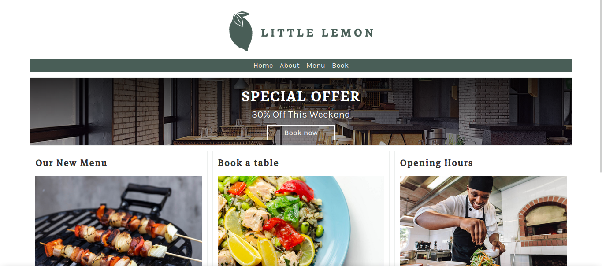

  

# Django Web Framework 

<p align="center"></p>


## Installation

1. Clone the repository

```bash
git clone https://github.com/mssj-11/Django-Web-Framework.git
```

2. Create a virtual environment and activate it

```python
python -m venv env
```

```
.\env\Scripts\activate
```

3. Install the dependencies
```
pip install -r requirements.txt
```

4. Run the server

```bash
python manage.py runserver
```


# Open
```bash
http://127.0.0.1:8000/
```


## Technologies Used

### Django Framework
- **Model-View-Template (MVT) Architecture:** Django's MVT architecture facilitates the separation of concerns, enhancing the project's maintainability and scalability.
- **Object-Relational Mapping (ORM):** Django's ORM simplifies database interaction by abstracting SQL queries into Python code.
- **Admin Interface:** Utilized Django's built-in admin interface for managing menu items.

### HTML/CSS/JavaScript
- **Frontend Development:** Implemented frontend components using HTML for structure, CSS for styling, and JavaScript for interactivity.

### SQLITE
- **Database Management:** Utilized SQLITE as the database management system to store menu items and other relevant data.

## Project Structure

The project follows a typical Django project structure, consisting of:
- **littlelemon:** Contains settings, URLs, and other project-level configurations.
- **App (restaurant):** Implements functionality related to menu items, including models, views, templates, and static files.

## Conclusion

This Django project demonstrates my proficiency in building web applications using Django framework. By effectively leveraging Django's features and adhering to best practices, I've developed a fully functional website for the Little Lemon restaurant, providing users with an intuitive interface to explore its menu offerings and make reservations.